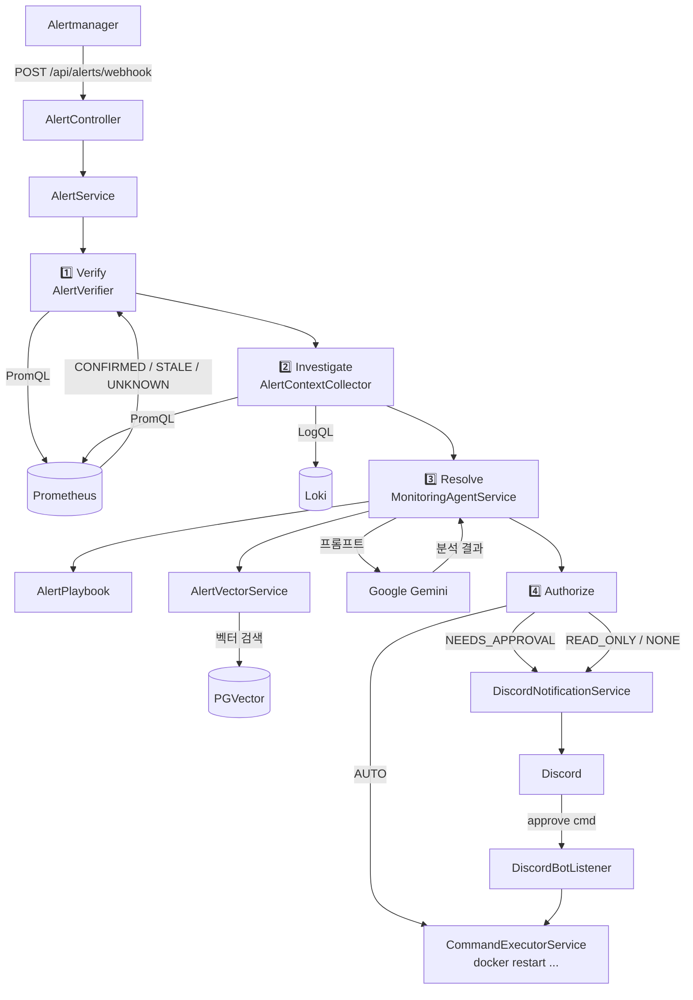

# Monitoring Agent


Alertmanager 웹훅을 수신해 AI 분석 → 자동 조치까지 처리하는 Spring Boot 기반 인시던트 대응 에이전트입니다.
알람 발생 시 Prometheus/Loki에서 실시간 컨텍스트를 수집하고, Google Gemini로 근본 원인을 분석한 뒤, Discord를 통해 결과를 전달하거나 자동으로 복구 명령을 실행합니다.

## 주요 기능

- **4단계 자동화 파이프라인**: Verify → Investigate → Resolve → Authorize
- **AI 분석**: Google Gemini 2.5-flash 기반 근본 원인 분석
- **RAG**: PGVector + Ollama(all-minilm)로 유사 과거 알람 검색 후 프롬프트에 주입
- **자동 복구**: Playbook에 등록된 AUTO 알람은 승인 없이 즉시 실행
- **Discord 승인 워크플로우**: NEEDS_APPROVAL 알람은 Discord Bot으로 승인 후 실행

## 시스템 아키텍처



## 기술 스택

| 분류 | 기술 |
|------|------|
| Framework | Spring Boot 3.5.7 (Java 21) |
| AI | Spring AI + Google Gemini 2.5-flash |
| Embedding | Ollama (all-minilm) |
| Vector Store | PGVector (PostgreSQL 16) |
| DB | PostgreSQL 16 |
| Discord | JDA 5.2.1 |
| Build | Gradle 8 |
| Container | Docker / Docker Compose |

## Alert Playbook

알람 이름별로 허가된 조치를 정의합니다. Gemini가 임의로 명령을 생성하지 않고, Playbook에 등록된 명령만 실행됩니다.

| 알람 | 카테고리 | 조치 |
|------|----------|------|
| ContainerRestarting | NEEDS_APPROVAL | `docker restart {name}` |
| ContainerOOMKilled | NEEDS_APPROVAL | `docker restart {name}` |
| ContainerDown | NEEDS_APPROVAL | `docker restart {name}` |
| ContainerHighMemoryUsage | READ_ONLY | 메모리 사용 현황 수집 |
| HostHighCpuLoad | READ_ONLY | CPU 점유 상위 프로세스 확인 |
| HostHighMemoryUsage | READ_ONLY | 메모리 점유 상위 프로세스 확인 |
| GPUDcgmExporterDown | **AUTO** | `docker restart dcgm-exporter` |
| GPUHighTemperature | READ_ONLY | GPU 부하 프로세스 확인 |
| GPUHighMemoryUsage | READ_ONLY | GPU 메모리 점유 프로세스 확인 |
| GPUUtilizationStuckHigh | READ_ONLY | GPU 작업 목록 확인 |
| ApolloGame* / ApolloGeneral* | READ_ONLY | Apollo 세션 상태 확인 |

카테고리:
- **AUTO**: 즉시 자동 실행
- **NEEDS_APPROVAL**: Discord에서 `approve <command>` 입력 시 실행
- **READ_ONLY**: 분석 정보만 Discord로 전달
- **NONE**: Playbook 미등록, 수동 대응 필요

## Discord 승인 워크플로우

```mermaid
sequenceDiagram
    participant AM as Alertmanager
    participant AG as monitoring-agent
    participant DC as Discord
    participant U as 운영자

    AM->>AG: webhook (firing)
    AG->>AG: 4단계 파이프라인 실행
    AG->>DC: 알림 전송<br/>"approve docker restart &lt;container&gt;"
    DC->>U: 알림 표시

    alt 30분 이내 승인
        U->>DC: approve docker restart &lt;container&gt;
        DC->>AG: DiscordBotListener 수신
        AG->>AG: 화이트리스트 검증
        AG->>AG: CommandExecutorService 실행
        AG->>DC: 실행 결과 회신
    else 30분 TTL 만료
        AG->>DC: "승인 대기 만료" 메시지
    end
```

## API

| 메서드 | 경로 | 인증 | 설명 |
|--------|------|------|------|
| POST | `/api/alerts` | Basic Auth | 알람 수동 생성 (level + message) |
| POST | `/api/alerts/webhook` | 없음 | Alertmanager 웹훅 수신 |
| GET | `/api/alerts/open` | Basic Auth | 미해결 알람 최신 20건 조회 |
| GET | `/api/alerts/similar?query=&topK=` | Basic Auth | 벡터 유사도 검색 |

### 웹훅 페이로드 예시 (Alertmanager 표준 포맷)

```json
{
  "alerts": [
    {
      "status": "firing",
      "labels": {
        "alertname": "ContainerDown",
        "name": "my-app",
        "severity": "critical"
      },
      "annotations": {
        "summary": "컨테이너 my-app 중단",
        "description": "5분 이상 응답 없음"
      },
      "startsAt": "2026-03-26T10:00:00Z"
    }
  ]
}
```

## 환경 변수

`.env` 파일을 생성하거나 `docker-compose.yml`의 environment 섹션에 값을 설정합니다.

| 변수 | 필수 | 설명 |
|------|------|------|
| `MONITORING_AGENT_DB_PASSWORD` | ✅ | PostgreSQL 비밀번호 |
| `MONITORING_AGENT_ADMIN_USERNAME` | ✅ | Basic Auth 사용자명 |
| `MONITORING_AGENT_ADMIN_PASSWORD` | ✅ | Basic Auth 비밀번호 |
| `SPRING_AI_GOOGLE_GENAI_APIKEY` | ✅ | Google AI Studio API 키 |
| `DISCORD_WEBHOOK_URL` | ✅ | 알림 전송용 Discord 웹훅 URL |
| `DISCORD_BOT_TOKEN` | 선택 | Discord Bot 토큰 (없으면 자동 승인 기능 비활성화) |
| `DISCORD_BOT_CHANNEL_ID` | 선택 | 봇이 수신할 채널 ID |
| `DISCORD_BOT_ALLOWED_ROLE_ID` | 선택 | approve 명령 허가 역할 ID |

## 실행 방법

### 사전 요구사항

- Docker + Docker Compose
- NVIDIA GPU (Ollama 임베딩 가속, CPU 전용도 동작)
- `monitoring-net` Docker 네트워크 (monitoring 프로젝트에서 생성)

### 시작

```bash
# 1. 환경 변수 설정
cp .env.example .env
vi .env  # 필수 값 입력

# 2. monitoring 프로젝트가 먼저 실행되어 있어야 함 (monitoring-net 생성)
cd ../monitoring && docker compose up -d

# 3. 에이전트 실행
cd ../monitoring-agent && docker compose up -d --build

# 4. Ollama 모델 다운로드 (최초 1회)
docker exec monitoring-agent-ollama ollama pull all-minilm
```

### 로그 확인

```bash
docker compose logs -f monitoring-agent-app
```

## 데이터베이스 스키마

```sql
-- 알람 이벤트
alert_event (
  id               BIGINT       PRIMARY KEY,
  level            VARCHAR(32),            -- INFO / WARNING / CRITICAL
  message          VARCHAR(500),
  alert_name       VARCHAR(255),           -- Alertmanager alertname 레이블
  labels_json      TEXT,                   -- 원본 레이블 JSON
  annotation_summary    VARCHAR(500),
  annotation_description TEXT,
  analysis_result  TEXT,                   -- Gemini 분석 결과
  verification_status VARCHAR(32),         -- CONFIRMED / STALE / UNKNOWN
  resolved         BOOLEAN DEFAULT FALSE,
  created_at       TIMESTAMP NOT NULL,
  resolved_at      TIMESTAMP,
  starts_at        TIMESTAMP               -- Alertmanager startsAt
)

-- 벡터 스토어 (Spring AI PGVector 자동 생성)
vector_store (
  id        VARCHAR(36) PRIMARY KEY,
  content   TEXT,
  embedding vector(384),  -- all-minilm 차원
  metadata  JSONB
)
```
